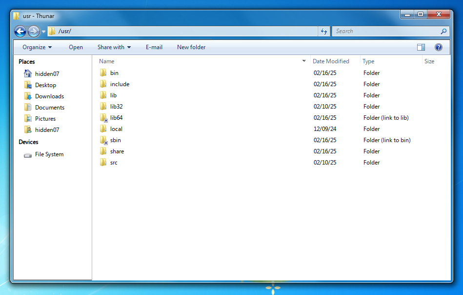
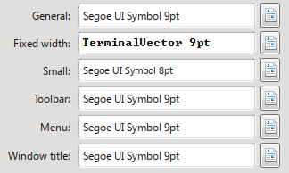

# GTKAero
A fork of B00MERANG Project's Windows 7 GTK theme made to integrate better with aerothemeplasma. Also makes thunar look more Windows 7's explorer.\
\
A picture of thunar with this theme and icon theme.

## Installation
To install the theme, follow these steps:

Place this repository in your "themes" folder:

```cp -r . ~/.local/share/themes/GTKAero```

Enable the theme in "Application style > Configure Gnome/GTK style" in KDE's System Settings.

Merge the repository's "Windows 7 Aero" with aerothemeplasma's icon folder (~/.local/share/icons/Windows 7 Aero).

**OR:** use https://gitgud.io/Pupilstudent32/aero-icons.

To merge the icon folders, copy the "Windows 7 Aero" folder and combine it with the aerothemeplasma's icon folder.

### KDE Configuration:

Go to System Settings > Window Management > Desktop Effects > Aero Glass Blur > Configure... > Overrides.

In the "Classes of windows to force blur" field, type "thunar" (without quotes).

To disable inner borders:

Go to Colours & Themes > Window Decorations and click on SMOD's "↻".

Navigate to Window-Specific Overrides and ensure "hide window inner border" is marked.

### Font Configuration

Download the required font from https://archive.org/download/segoe/Windows%207.zip.

Configure the font and font size as shown in the screenshot:\
\
The setup should match this image.

### Thunar Configuration:

Align the toolbar buttons correctly.

Uncheck the "statusbar" and "menubar" (or press "Ctrl" + "M").

### Optional: Picture Thumbnail Functionality

If you miss image thumbnail functionality like in Dolphin, install tumbler using the following command:

```sudo pacman -S tumbler```

### Note:
The commandbar is only a texture and is not clickable in any way. 
Perhaps it might be possible to add such functionality in the future, but I am not considering it now.

### Supported platforms:
- Any GTK-based desktop
- Cinnamon
- Gnome
- MATE
- Xfce
- KDE

### Bugs + issues
- Some buttons might look strange.
- Not able to make the font in Thunar's sidebar normal or "not bold" yet.

### Forked code:
- [Windows 7 GTK](https://github.com/B00merang-Project/Windows-7)
- [Chicago95](https://github.com/grassmunk/chicago95) (Some thunar code).
- [aerothemeplasma](https://gitgud.io/wackyideas/aerothemeplasma/) (Icon theme).
