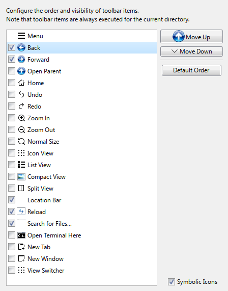

# GTKAero
A fork of B00MERANG Project's Windows 7 GTK theme made to integrate better with [aerothemeplasma](https://gitgud.io/wackyideas/aerothemeplasma/). Also makes thunar look more Windows 7's explorer.\
\
A picture of thunar with this theme and icon theme.

## Installation
To install the theme, follow these steps:

Place this repository in your "themes" folder:

```cp -r . ~/.local/share/themes/GTKAero```

Enable the theme in "Application style > Configure Gnome/GTK Application style" in KDE's System Settings.

Move this icon theme to ~/.local/share/icons/: https://gitgud.io/Pupilstudent32/aero-icons, without merging anything.\

Enable the icon theme in settings (called AeroIcons).

**If that did not specifically work:**\
try to copy this image into ~/.local/share/icons/Windows 7 Aero/apps/24/:\
\
It should be named "system-search-symbolic.png".\
And copy this image to ~/.local/share/icons/Windows 7 Aero/actions/24/:\
\
It should be named "view-refresh-symbolic.png".\

### KDE Configuration:

Go to System Settings > Window Management > Desktop Effects > Aero Glass Blur > Configure... > Overrides.

In the "Classes of windows to force blur" field, type "thunar" (without quotes).

To disable inner borders:

Go to Colours & Themes > Window Decorations and click on SMOD's "↻".

Navigate to Window-Specific Overrides and create an exception for Thunar.

Mark "hide window inner border", "hide window caption" and "hide window icon".

### Font Configuration

Download the required font from https://archive.org/download/segoe/Windows%207.zip.

Configure the font and font size as shown in the screenshot:\
\
The setup should match this image.

### Thunar Configuration:

Set the sidebar icons to 16px in Thunar Settings > Sidepane.

Align the toolbar buttons correctly:\


Uncheck the "statusbar" and "menubar" (or press "Ctrl" + "M").

### Optional: Picture Thumbnail Functionality + Better partition integration

If you miss image thumbnail functionality like in Dolphin, install tumbler using the following command:

```sudo pacman -S tumbler```

I would also recommend gvfs for better drive functionality:

```sudo pacman -S gvfs```

### Note:
The commandbar is only a texture and is not clickable in any way. 
Perhaps it might be possible to add such functionality in the future, but I am not considering it now.

If you are trying to find a Vista-variant of this project, check out [4194304's fork of this project](https://github.com/4194304/GTKVista).

### Supported platforms:
- Mainly KDE
- Cinnamon
- Gnome
- MATE
- Xfce
- Other GTK-based DEs.

### Bugs + issues
- Some buttons might look strange.
- Not yet possible to set the font in Thunar's sidebar headers to a normal (non-bold) style without modifying Thunar's source code. [See this discussion](https://forum.xfce.org/viewtopic.php?id=18246) for more details.

### Forked code:
- [Windows 7 GTK](https://github.com/B00merang-Project/Windows-7)
- [Chicago95](https://github.com/grassmunk/chicago95) (Some thunar code).
- [aerothemeplasma](https://gitgud.io/wackyideas/aerothemeplasma/) (Icon theme licensed under AGPLv3).
