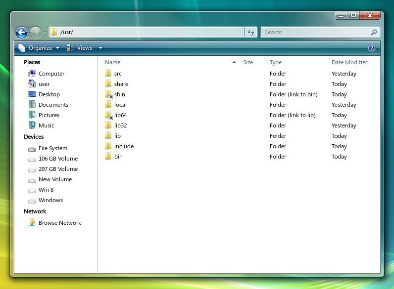

# Windows 7
A fork of B00MERANG Project's Windows 7 GTK theme made to integrate better with aerothemeplasma. Also makes thunar look more Windows 7's explorer.

A picture of thunar with this theme and icon theme.

### Installation:
Put this repository into your "themes" folder and enable it in "Application style > Configure Gnome/GTK style" if using KDE.

Copy the "Windows 7 Aero" folder and replace it with aerothemeplasma's icon folder (merge them together).

To make the transparent background match your titlebar colour, go into GTKAero/gtk-3.0/windows.css
and change the box-shadow to a matching colour.

In thunar: align the toolbar buttons correctly and uncheck "menubar".

### Supported platforms:
- Any GTK-based desktop
- Cinnamon
- Gnome
- MATE
- Xfce
- KDE

### Bugs + issues:
- Not able to make the transparent background blurred.
- Some buttons might look strange.

### Forked code:
- [Windows 7 GTK](https://github.com/B00merang-Project/Windows-7)
- [Chicago95](https://github.com/grassmunk/chicago95) (Some thunar code).
- [aerothemeplasma](https://gitgud.io/wackyideas/aerothemeplasma/) (Icon theme).
